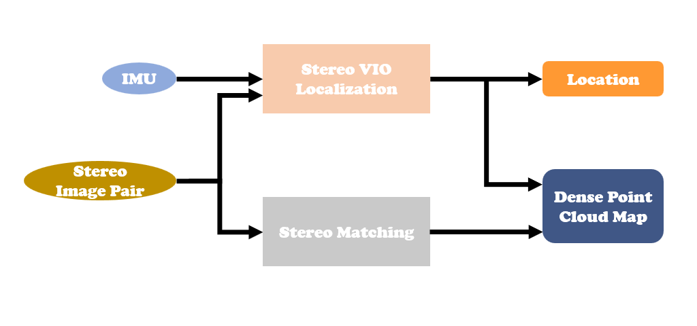

# Dense-SLAM based on VINS & CGI
A Dense-SLAM Project for getting Real-time dense 3D map. 
## To Start With
First, you should konw how to deploy a VSLAM project (such as ORB-SLAM3 or VINS-Fusion) on your rebot. 
Our project is based on [VINS-Fusion](https://github.com/HKUST-Aerial-Robotics/VINS-Fusion) and [CGI-Stereo](https://github.com/gangweiX/CGI-Stereo). 
Before go to next part, please follow the **Prerequisites** part of VINS-Fusion and make sure your rebot can successfully run *Stereo cameras* or *Stereo cameras + IMU*.
## Method

